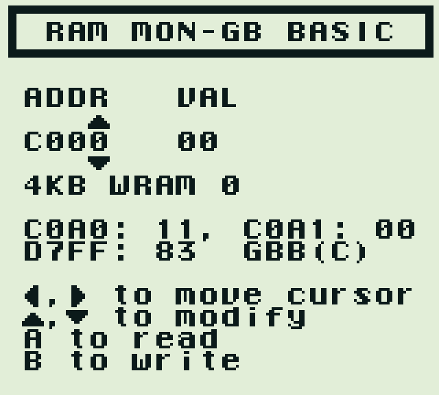

## RAM MON

RAM MON is a [GB BASIC](https://paladin-t.github.io/kits/gbb/) program runs on GameBoy, which allows it to read and write to the memory bus directly.

Read [Memory Map](https://gbdev.io/pandocs/Memory_Map.html) for technical details about the memory bus.

### Running

Put "RAM MON.gb" on any GameBoy device, and launch it. It shows a memory bus accessing interface, and also guesses the running device type.

#### Usages

- D-Pad Left/Right to move the cursor
- D-Pad Up/Down to modify the numbers
- A button to read from the specific address
- B button to write to the specific address

   

### Source Code

Open "RAM MON.gbb" with the [latest GB BASIC](https://store.steampowered.com/app/2308700/), it implements all common features. If you prefer to enable extra platform detection, such as Analogue Pocket etc. consider installing the dedicated kernel "kernel/for_ram_mon.zip" in GB BASIC for this RAM MON program. The "kernel" directory also contains the kernel's source code.
